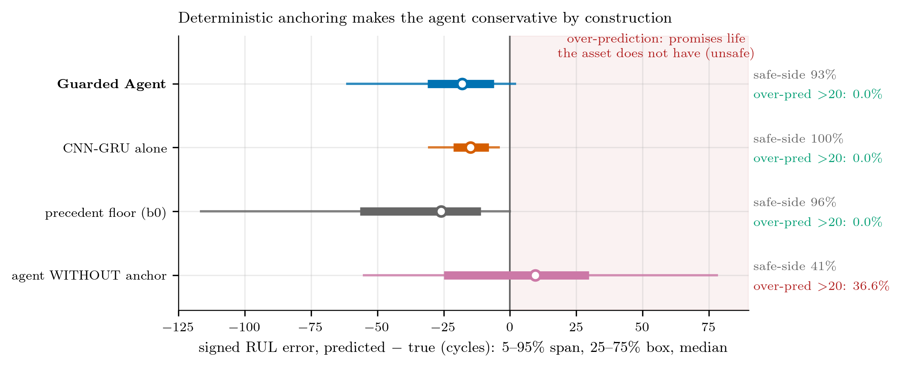
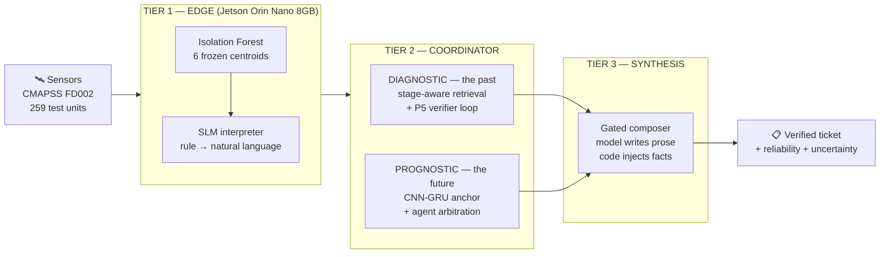
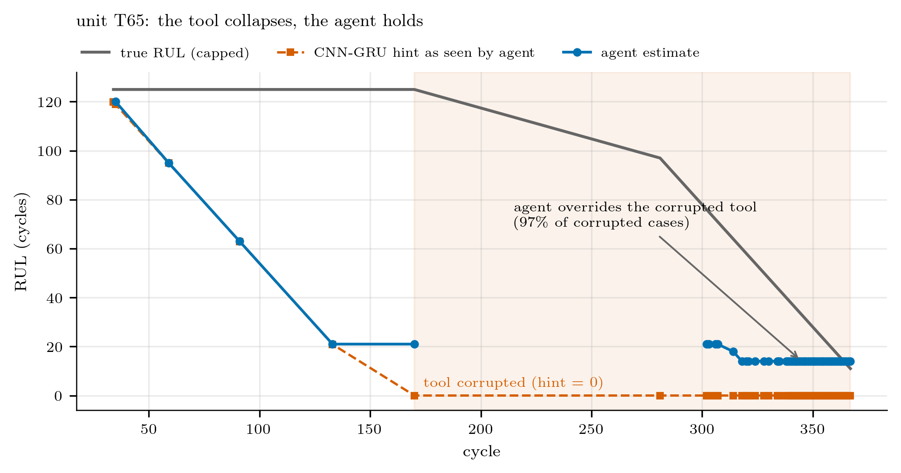
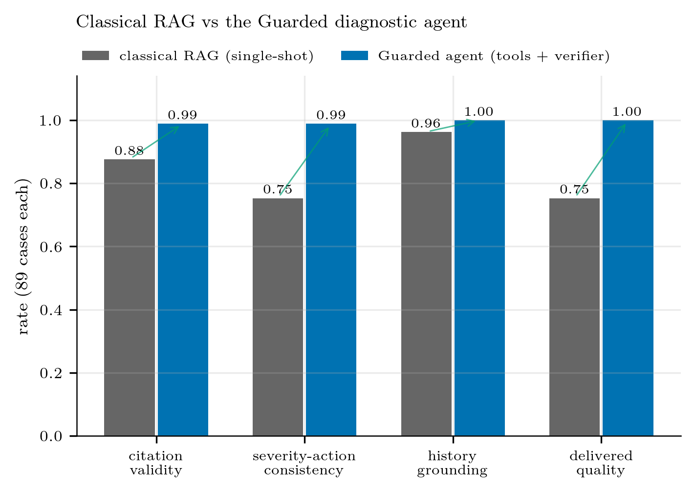
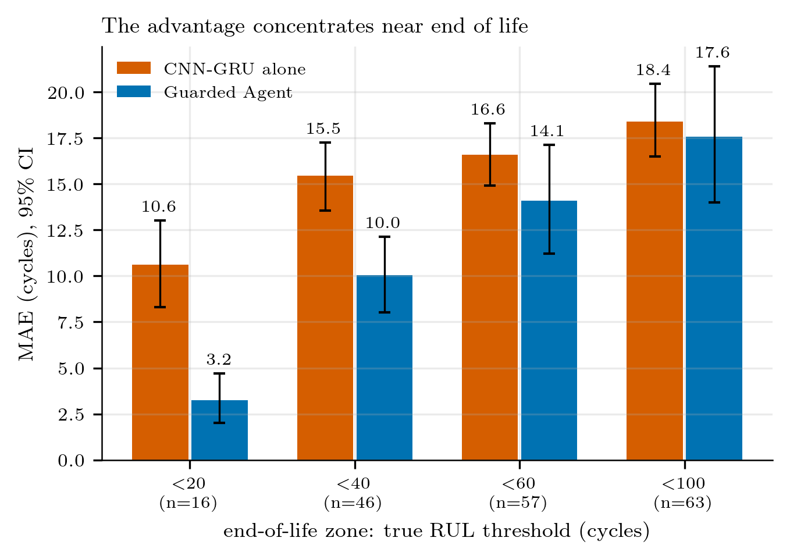
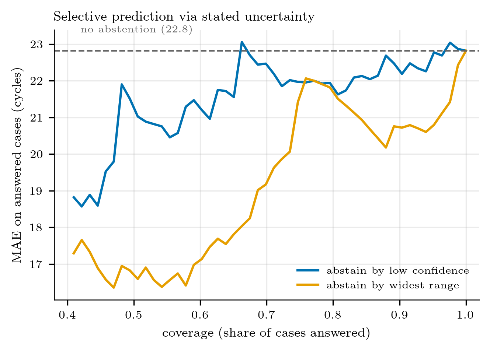
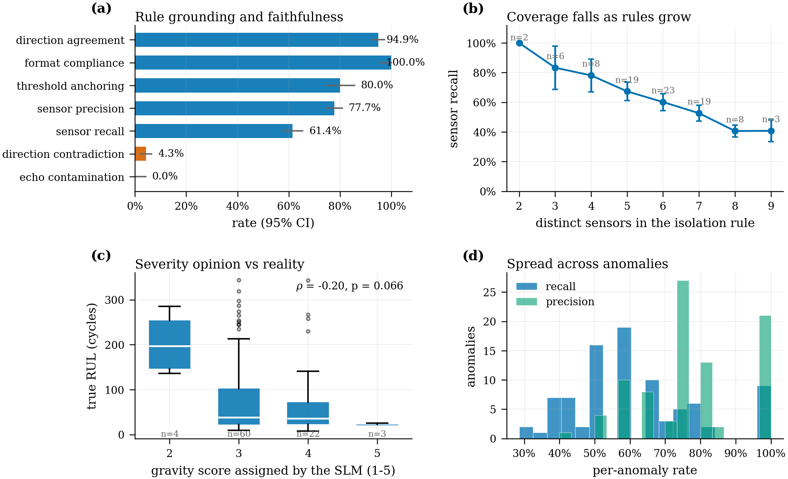

# A-RAD — Agentic Retrieval-Augmented Diagnosis

**Agentic Retrieval-Augmented Predictive Maintenance with Small Language Models at the IoT Edge**

Flora Amato · Alberto Moccardi · Rajib Chandra Ghosh
IDEAL Lab, DIETI — University of Naples Federico II


A three-tier predictive-maintenance pipeline that runs a **3-billion-parameter**
model on edge hardware and still produces citation-grounded, verified maintenance
tickets. The central claim is not that a small model is smart — it is that a small
model becomes *trustworthy* when every quantitative responsibility is handed to a
deterministic component and the model is left to do what it is actually good at:
reading precedent, arbitrating, and writing.

**Every responsibility in this system was assigned by a pre-registered experiment,
not by preference.** The tables below record which experiment decided what.

---

## The headline result

Give a 3B agent a deterministic anchor and its *risk profile inverts* — not just
its accuracy.



Without the CNN-GRU anchor, the agent promises life the asset does not have in
**36.6%** of cases (q95 = +78 cycles). With the anchor: **0.0%** dangerous
over-predictions, q95 = +2, safe-side **93%**. The cost is bounded and measured —
**+7.0 cycles MAE [+2.7, +11.5]** against the clean tool. In maintenance, that is
the right trade: a late-but-safe estimate is recoverable, an optimistic one is not.

---

## Architecture



### Who owns what, and which experiment decided it

| Responsibility | Owner | Decided by |
|---|---|---|
| Anomaly interpretation | Edge SLM (Jetson) | edge study |
| Diagnosis: severity / action / citations | SLM agent (`P5_verifier`) | `final_diagnostic` — 88/89, 1 escalation |
| **RUL number** | **CNN-GRU tool (deterministic)** | `clean_tool_study` — agent 50.3 vs tool 15.6 |
| Future outlook figures | Deterministic progression signal | `progression_run` — SLM horizon ρ +0.27 only |
| Progression narrative | SLM (commentary, cited) | `progression_run` — 89/89, 75 templates |
| Ticket trust | Deterministic reliability + uncertainty | `plot_reliability` — spread [0.00, 0.83] |
| Final ticket composition | SLM composer (JSON-first) | `synthesis_run` LIVE — 89/89, 2.8 s/ticket |

The recurring finding across all three tiers: **at 3B, the model's decision to
answer is better calibrated than its answers.** Voluntary production is far more
selective than forced production (ρ +0.75 voluntary vs +0.27 forced).

---

## Five results

### 1. The rescue — measured, selective tool-skepticism



On 60/89 cases whose DL hint was silently corrupted to ~0, the agent — **never told
of the fault** — overrode its tool in **97%** of cases and cut error from **33.5 →
18.9** cycles (paired −13.9 [−14.9, −12.7]), staying safe-side in 87%.

The override policy is systematic, not lucky: P(override) rises **36% → 84% → 92%**
with the disagreement between hint and the median cited precedent, and the
overriding estimate anchors on those precedent futures. On *uncorrupted* cases the
agent defers — override drops to 38%. It is skeptical exactly when it should be.

### 2. Guardrails beat single-shot RAG on every delivered-quality axis



Citation validity 0.88 → **0.99**, severity–action consistency 0.75 → **0.99**,
history grounding 0.96 → **1.00**, delivered quality 0.75 → **1.00** — at a cost of
1.46 mean steps (1 generation + 0.46 repairs).

### 3. Superiority concentrates exactly where it matters



Inside true RUL < 20 the agent **halves its own clean tool**: MAE **3.2 vs 10.6**,
median S-score 0.2 vs 1.3, 88% of cases improved. Combined with result (1) the
design principle is: *conservative reserve early in life, sharpness at end of life —
trust the tool early, arbitrate late.*

### 4. The diagnostic mechanism, and the collapse of escalation

Plain cosine retrieval cites outcomes that ignore the case
(ρ(cited outcome, true RUL) = **0.05**); grounding constraints make that bias
binding, and the RUL-coupled design escalates **97.8%** of cases. Stage-aware
retrieval restores relevance (ρ → **0.50**, paying only 0.013 mean similarity), and
the retrospective redesign brings escalation to **1.1%** with 12.4% auto-corrected
and action coherence **8% → 99%**.

### 5. The model knows when to shut up — better than what to say



Abstaining on the agent's own widest stated ranges cuts MAE from 22.8 to **~16.4**
at ~55% coverage. Abstaining by stated *confidence* barely helps. The width of what
it says is informative; its confidence label is not.

---

## The edge tier



Frozen Isolation-Forest detection plus SLM interpretation on a Jetson Orin Nano
8 GB, verified against the training knowledge base: cluster assignment reproduced
(2 boundary ties in 53,759 rows), **anomaly labels 100%**, rule text **99.94%
byte-equal**, and a 20/20 offline guard suite.

Interpretation is **strictly causal** — the prompt never contains RUL, only rule
text, cumulative counters and up to three *previous* in-unit anomalies. Few-shot
examples come from TRAIN units only. Format compliance is 100% and echo
contamination 0.0%, but sensor recall is 61.4% and falls as isolation rules grow
wider — a real coverage limit, reported rather than hidden.

---

## What does *not* work

Reported because a system that only publishes its wins cannot be trusted:

- **Outlook prediction collapses to the base rate** — 139/139 "accelerating", where
  the base rate is 0.71.
- **Per-sensor trend classification sits at chance** — 0.29–0.31 on 3 classes.
- **3B models never self-terminate tool loops** — 3.99 of a 4-step budget consumed.
  The budget is the stopping rule; the model has none.
- **Severity is stage-agnostic** — the agent's severity does not track life stage
  (ρ = −0.13, n.s.) while deterministic precedent gravity does (ρ = −0.35,
  p < 0.001). The graded signal lives in retrieval, not in the model.

The design conclusion is consistent: **severity prior from precedents, LLM
adjustment on top** — the same anchoring lesson as prognosis, mirrored.

---

## Quick start

```powershell
pip install -r requirements.txt
ollama pull nomic-embed-text
ollama pull llama3.2:3b
```

```powershell
cd agentic
python -m apdm.synthesis.run --backend ollama    # compose all 89 tickets
python -m apdm.synthesis.run --stats
```

Edge tier (on the Jetson, or any host with a llama.cpp server):

```bash
cd edge
ARAD_SMOKE_FAST=1 python3 -m arad_edge smoke      # 20 checks, fully offline
python3 scripts/run_reference.py --n 8 --seed 1   # detect → interpret → stats
python3 scripts/run_stream.py --n 5 --tick 0.5    # live collection simulation
```

The edge model bundle is **self-healing**: if `models/edge_bundle.joblib` was
written under a different numpy/sklearn, the first load detects it and
deterministically rebuilds the identical model (seed 42) from the KB.

Reproduce every paper artifact:

```powershell
python paper\code\make_figures.py                 # must end: VERIFIED 21/21
python paper\code\stats\phase2_analysis.py
python paper\code\plot_reliability.py
```

Full sequences: [RUNBOOK.md](RUNBOOK.md), [edge/RUNBOOK.md](edge/RUNBOOK.md),
and per-tier runbooks under `agentic/apdm/*/RUNBOOK.md`.

---

## Repository layout

```
edge/                       Tier 1 — self-contained, own README/RUNBOOK
  arad_edge/                detector · interpreter · collector · daemon · telemetry
  models/                   frozen IF bundle + six training centroids
  notebooks/                fits and exports the bundle (executed copy included)
  tests/smoke.py            20-check offline guard suite

agentic/
  apdm/
    diagnostic/             the past   — bench, run, tools
    prognostic/             the future — bench, forecast, signals, eval, timings
    synthesis/              the reporting layer — gates, template, compose
    studies/                earlier campaigns (runnable)
    data.py llm.py patterns.py vector_store.py hardware.py     shared core
  data/ queries/ models/    knowledge base, query sets, CNN-GRU hints
  results/                  ALL experimental data (see index below)

paper/
  code/make_figures.py      the figure engine (VERIFIED 21/21)
  code/stats/               phase2, MAE, bands, signals, costs, uncertainty
  figures/                  the 21 selected figures (PDF + PNG)
  tables_stats/             TOP5_RESULTS.md, stats.md, LaTeX tables
```

### Results index

| Directory | What it holds |
|---|---|
| `study_A_pattern_grid` | 1,691-episode prompt-pattern study |
| `v2_rul_coupled_collapse` | the 97.8%-escalation mechanism study |
| `final_diagnostic` | published diagnostic run (88/89) |
| `final_prognostic` | published prognostic run, 4 arms |
| `clean_tool_study` | the inversion finding (agent 50.3 vs tool 15.6) |
| `progression_run` | progression-only run (89/89; numeric horizon retired) |
| `synthesis_run` | all 89 composed tickets — `final_tickets.md` |
| `analysis/` | curated stats: signals, MAE, bands, uncapped, costs |

---

## Benchmarks

Diagnostic patterns (89 cases each):

| Pattern | Citation | Coherence | History grounding | Escalation | Auto-corrected |
|---|---|---|---|---|---|
| `B0_retrieval` | 1.000 | 1.000 | 0.000 | 0.000 | 0.000 |
| `P1_direct` | 0.000 | 0.966 | 1.000 | 0.000 | 0.000 |
| `P2_rag` | 0.876 | 0.753 | 0.963 | 0.000 | 0.000 |
| **`P5_verifier`** | **0.989** | **0.989** | **1.000** | 0.011 | 0.124 |

Prognostic arms:

| Arm | MAE | Bias | S-score (med) | Coverage | Width | Monotonicity |
|---|---|---|---|---|---|---|
| `dl_only` | **15.63** | −15.63 | 2.15 | — | — | 0.00 |
| `P7_agent_dl` | 22.82 | −22.07 | **2.99** | 0.51 | 39.61 | 0.63 |
| `P7_agent` | 36.28 | +7.94 | 12.06 | 0.10 | 14.09 | 0.73 |
| `b0_median` | 41.24 | −40.49 | 6.39 | 0.46 | 31.28 | 0.73 |

`dl_only` wins on raw MAE; `P7_agent_dl` is the deployed arm because it buys
calibrated intervals, end-of-life sharpness and the corruption rescue for a
bounded +7.0 cycles.

---

## Citation

```bibtex
@article{amato2026arad,
  title  = {Agentic Retrieval-Augmented Predictive Maintenance with
            Small Language Models at the IoT Edge},
  author = {Amato, Flora and Moccardi, Alberto and Ghosh, Rajib Chandra},
  year   = {2026},
  note   = {IDEAL Lab, DIETI, University of Naples Federico II}
}
```

Dataset: NASA CMAPSS turbofan degradation, subset FD002.

> **Censoring note.** Official CMAPSS test trajectories stop before failure, so the
> test anomaly rate is ~3.1% against the 10% training contamination (frozen, not
> re-fit). This is fine for the streaming and diagnostic demonstrations and for all
> comparative metrics, but it should be stated wherever absolute prognostic error
> is reported.
